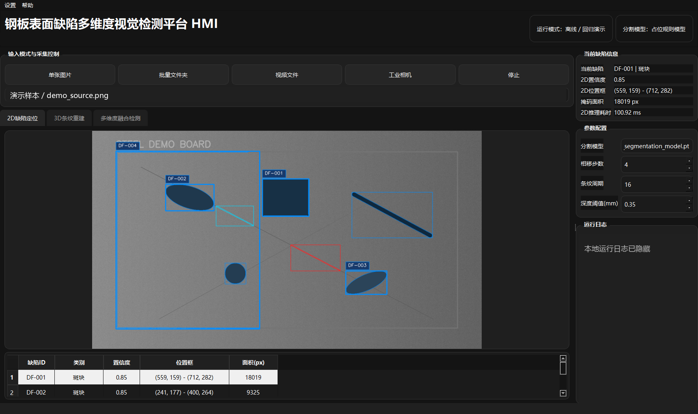
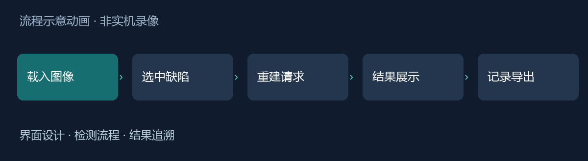

# 钢板缺陷检测 HMI｜交互设计记录

我在大创项目中负责 UI 界面设计。这里记录如何把检测图像、缺陷列表、参数配置和运行状态组织成一个可以理解和操作的工作台。界面仍在完善。

## 界面预览

*来自已有源码交付包的真实界面截图；已隐藏本地路径和日志。截图使用演示样本及占位模型，数值不是工业测量精度或模型性能指标。*

*流程示意动画，不是实时录屏。*

## 我的工作重点

UI 设计围绕图像主视图、缺陷信息与操作反馈展开。算法训练、结构光重建与界面设计属于不同工作范围；此处重点记录界面如何承接算法输出，而不把团队算法归为个人成果。

## 从现有实现中整理的设计问题

- 二维页面选中的缺陷应当与后续重建任务对应，避免结果串样。
- 重建耗时较长，需要状态提示和重复点击保护。
- 无缺陷、空掩码和设备不可用时，应给出可以采取下一步行动的提示。
- 保存历史时，表格记录与图像资产需要保持对应。

交付包使用 PyQt5，含后台采集和重建线程、SQLite 历史记录及报告导出代码。当前展示基于 Mock/验证版本，真实模型和工业设备联调未在本次核验。

[交互设计与验证边界](docs/design-notes.md)

## 当前进度

已整理二维页面截图和流程说明。下一阶段重点是明确任务运行状态、结果来源与异常恢复路径。源码及第三方依赖尚未作为公开发布包交付。
